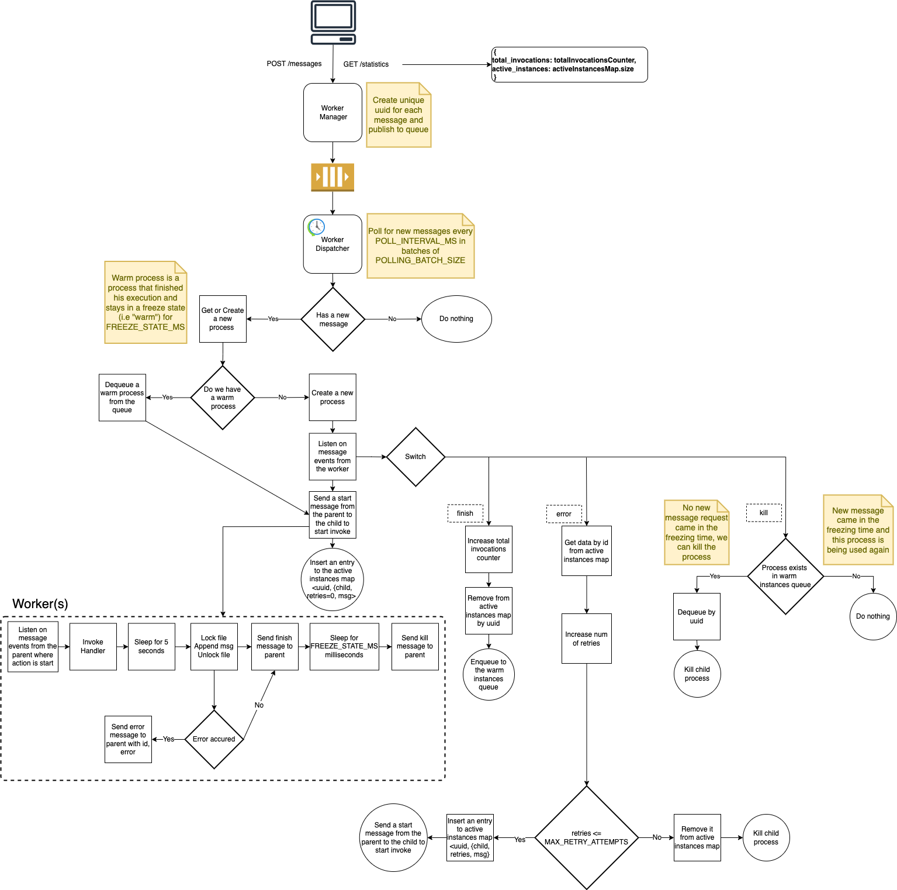

# lumigo-developer-test
**Implement a simple auto scale mechanism**
## Architecture


## Environment variables
Project environment variable are found here [.env](.env)
```
POLLING_INTERVAL_MS=10    // message queue polling interval
POLLING_BATCH_SIZE=10     // message queue polling batch size
FREEZE_STATE_MS=1000      // child process freeze ("warm") state in milliseconds
PORT=8000                 // server port     
FILE_NAME=shared-file.txt // name of the shared file
MAX_RETRY_ATTEMPTS=20     // maximum retry attempts in case of process failure
SHOW_LOGS=true            // show logs flag
```

## Assumptions
1. Function Asynchronous invocation
2. An active instance is an instance currently running (not in a warm state)
3. Total invocations does not count retries, only successful finish functions


## Usage
### Install project dependencies
```
npm i
```
### Start project
```
npm start
```
### Push a message
```
curl --header "Content-Type: application/json" --request POST --data '{"message":"I'm a message"}' http://localhost:8000/messages
```
### Get statistics
```
curl http://localhost:8000/statistics
```
## Test
### Install loadtest globally
``
npm i -g loadtest
``
### Run loadtest
#### Sanity
```
loadtest -n 120 -c 1  -T 'application/json' --data '{"message":"My My, Hey Hey"}' -m POST --rps 1  http://localhost:8000/messages
```
#### Load test
```
loadtest -n 2000 -c 50  -T 'application/json' --data '{"message":"My My, Hey Hey"}' -m POST --rps 50  http://localhost:8000/messages
```